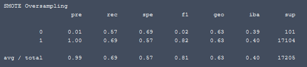
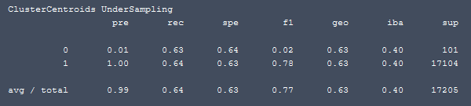
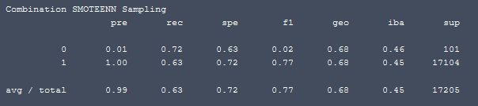
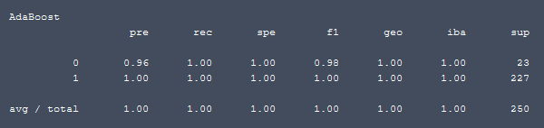

# Supervised Machine Learning
In this repository I demonstrate using supervised machine learning techniques with python and many common libraries to perform machine learning that predict data outcome.  A data set from LendingClub was used [(LoanStats_2019Q1.csv)](LoanStats_2019Q1.csv).  In the repo there are 2 Jupyter notebook files that has all the details.  

## Written Analysis of Result:
Because our LendingClub data class is inherently imbalanced between amounts of high and low risk loans, I've used 4 different sampling techniques to resolve class imbalance: Oversampling by using Naive Random and SMOTE, Undersampling by using Cluster Centroid, and Combination (Over and Under) Sampling.  The resampled data is then fit or trained with logistic regression model.  Below show screen captures of some of the finding.   
 
Balanced Accuracy Score: 0.64

 
Balanced Accuracy Score: 0.63

 
Balanced Accuracy Score: 0.63

 
Balanced Accuracy Score: 0.63

All of the sampling techniques showed poor precision on high risk (class 0) loans at 0.01, and perfect precision on low risk (class 1) loans at 1.00.  Recall for all models ranged between 0.57 to 0.72, so there's no overfitting.  All the Balanced Accuracy Scores were either 0.64 or 0.63.  The prediction outcome is clearly affected by data preparation.  Not being the focus of the exercise, the variables were prepared loosely by my convenience, I also used mixmax scaler to demonstrate scaling as a possibility.  More elaborate preparation and scaling is to be expected in real world.  

As an extension of the exercise, I also use ensemble learners with Balanced Random Forest, and AdaBoost to demonstrate additional ways to gain insight and tools of machine learning with data.  While the BRF did not yield significant improvements, the AdaBoost method yielded a significant improvement.  With .96 precision and 1.00 recall for high risk prediction, and 1.00 precision and 1.00 recall for low risk loans.  We can also leverage the "importance order" of factors found for future fine tune and further iteration.  The factors will be useful to help data normalization and scaling.  For example, "total_pymnt" was found as a good indicator and common sense also agree that it should be considered for higher weight in an analysis.  Therefore, my recommendation for future exercise, more iteration and further fine tuning is to use AdaBoost with better weighted preprocessed data.  The reason being AdaBoost clearly outperform all the example models used.  

